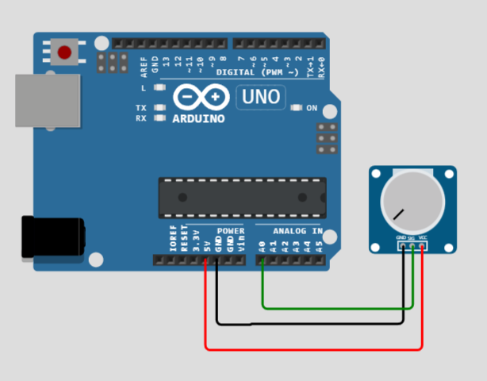

## Overview
A easy way to communicate between your Arduino and PC. Use the built-in serial port of an Arduino to communicate with a Java program.
In this demo, a simple graphical user interface is made with a slider to show the position of a potentiometer.
The program could be easily extended to send data from an Arduino to a web site. Check back for more videos on this topic.

Arduino Code:

    void setup(){
    Serial.begin(9600);
    }
    void loop(){
    int sensorValue = analogRead(A0);
    Serial.println(sensorValue);
    delay(1);
    }

## Main.java

    import java.util.Scanner;
    import javax.swing.JFrame;
    import javax.swing.JSlider;
    import com.fazecast.jSerialComm.*;
    
    public class Main {
    
        public static void main(String[] args) {
    
            JFrame window = new JFrame();
            JSlider slider = new JSlider();
            slider.setMaximum(1023);
            window.add(slider);
            window.pack();
            window.setVisible(true);
    
            SerialPort[] ports = SerialPort.getCommPorts();
            System.out.println("Select a port:");
            int i = 1;
            for(SerialPort port : ports)
                System.out.println(i++ +  ": " + port.getSystemPortName());
            Scanner s = new Scanner(System.in);
            int chosenPort = s.nextInt();
    
            SerialPort serialPort = ports[chosenPort - 1];
            if(serialPort.openPort())
                System.out.println("Port opened successfully.");
            else {
                System.out.println("Unable to open the port.");
                return;
            }
            //serialPort.setComPortParameters(9600, 8, 1, SerialPort.NO_PARITY);
            serialPort.setComPortTimeouts(SerialPort.TIMEOUT_READ_BLOCKING, 0, 0);
    
            Scanner data = new Scanner(serialPort.getInputStream());
            int value = 0;
            while(data.hasNextLine()){
                try{
                    value = Integer.parseInt(data.nextLine());
                    System.out.println("data : "+data);
                    System.out.println("value : "+value);
                    System.out.println("data : "+data.nextLine());
                }catch(Exception e){}
                slider.setValue(value);
    
            }
            System.out.println("Done.");
        }
    
    }

## Maven

The latest version of fazecast is available from Maven Central at
the following coordinates:

    <dependency>
        <groupId>com.fazecast</groupId>
        <artifactId>jSerialComm</artifactId>
        <version>[2.0.0,3.0.0)</version>
    </dependency>

`<Source>` : <https://www.youtube.com/watch?v=8B6j_yr9H8g># Arduino-Java
